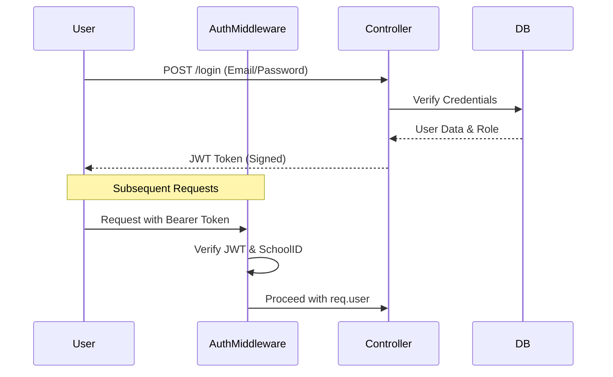

# School ERP: Backend Architecture & Workflow Documentation

This document provides a high-level and detailed technical overview of the School ERP backend system, including database schemas, core workflows, and execution patterns.

## 🛠 Technical Ecosystem
- **Runtime**: Node.js
- **Language**: TypeScript (Type-safe business logic)
- **Framework**: Express.js
- **Database**: PostgreSQL (Relational integrity)
- **Utilities**: PG Pool (Connection management), JWT (Security), Bcrypt (Hashing)

---

## 📊 Database Schema (Tables & Relationships)

The system utilizes a highly relational PostgreSQL schema. All primary keys are `UUID` for distributed security and scalability.

### 1. Core Identity & Access
| Table | Purpose | Key Relationships |
|-------|---------|-------------------|
| `schools` | Root entity for multi-tenancy. | - |
| `users` | Authentication credentials & roles. | `FK: school_id` |
| `user_profiles` | PII (Personal Identifiable Information). | `FK: user_id` |

### 2. Academic Infrastructure
| Table | Purpose | Key Relationships |
|-------|---------|-------------------|
| `academic_years` | Defines the calendar scope. | `FK: school_id` |
| `classes` | Integrated cohorts (e.g., Class 10). | `FK: school_id` |
| `sections` | Partitions within classes (e.g., A, B). | `FK: class_id` |
| `subjects` | Master list of academic subjects. | `FK: school_id` |

### 3. Stakeholder Management
| Table | Purpose | Key Relationships |
|-------|---------|-------------------|
| `students` | Core student academic records. | `FK: user_id`, `class_id` |
| `parents` | Parent/Guardian profiles. | `FK: user_id` |
| `teachers` | Staff records and assignments. | `FK: user_id` |
| `teacher_class_assignments` | Mapping teachers to sections/subjects. | `FK: teacher_id`, `class_id`, `section_id` |

### 4. Examination Engine
| Table | Purpose | Key Relationships |
|-------|---------|-------------------|
| `exams` | High-level exam cycle (Annual 2026). | `FK: school_id`, `academic_year_id` |
| `exam_schedules` | The "Matrix" (Class 10 -> Math -> Date). | `FK: exam_id`, `class_id`, `subject_id` |
| `exam_marks` | Atomic student performance records. | `FK: exam_schedule_id`, `student_id` |

---

## 🔄 Core Workflows (Execution Logic)

### 1. Authentication Flow

### 2. Exam Creation & Timetable Flow
1.  **Global Initialization**: Admin creates an `exam` record (Name, Dates).
2.  **Cohort Integration**: Admin selects `classes` (Participating Classes).
3.  **Matrix Mapping**: For each selected class, the system maps `subjects` to specific dates and times in `exam_schedules`.
4.  **Broadcast**: Upon saving, a `transaction` ensures all records are created simultaneously.
5.  **Notification**: The system triggers an instant broadcast to **Students** and **Class Teachers** via the `notifications` table.

### 3. Fee Collection Flow
1.  **Generation**: Monthly fee records are generated in `student_fees` based on `classes.monthly_fee_amount`.
2.  **Payment**: When a parent pays, a record is created in `fee_payments`.
3.  **Transaction**: A PostgreSQL `transaction` updates `student_fees.amount_paid` and `student_fees.status` while creating the `receipt_number`.

---

## 🛡 Security & Guardrails

- **Multi-tenancy**: Every query is gated by `WHERE school_id = $1` extracted from the JWT token. No user can see data from another school.
- **Role Guards**: 
    - `managementAccess`: Can manage architecture, fees, and staff.
    - `teacherAccess`: Can mark attendance and enter marks.
- **Database Safeguards**: 
    - `transaction()` utility handles `BEGIN`, `COMMIT`, and `ROLLBACK` for any multi-step operation to prevent partial data corruption.
    - Foreign Key cascading (`ON DELETE CASCADE`) ensures that deleting an exam automatically cleans up its schedule and marks.

---

## ⚙ Execution Engine Pattern

All controllers follow a standardized implementation pattern:
1.  **Extraction**: Extract parameters from `req.params`, `req.query`, and `req.user`.
2.  **Transaction**: If performing a mutation, wrap logic in `transaction(async (client) => { ... })`.
3.  **Response**: Use `successResponse` or `errorResponse` utilities for consistent JSON output.
4.  **Logging**: Execution time and row counts are logged in `development` mode for performance tuning.
